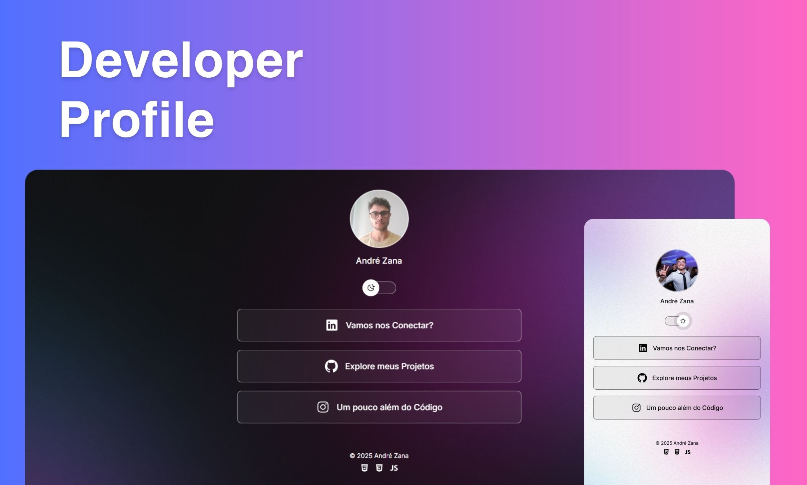

<h1 align="center"> Developer Profile </h1>

Meu espaço digital: um hub de links que conecta meu perfil profissional, projetos e redes sociais em um só lugar.

 

  

## 🚀 Tecnologias

Esse projeto foi desenvolvido com as seguintes tecnologias:

- HTML e CSS
- JavaScript
- Git e Github

## 💻 Projeto

Bem-vindo(a) ao meu hub de conexões!

Este projeto nasceu da necessidade de unificar meus links profissionais e pessoais em um único local, facilitando o acesso para recrutadores, colegas e amigos.
Mais do que um simples "link na bio", esta página é meu espaço digital, refletindo tanto minha trajetória como desenvolvedor quanto meus interesses pessoais. Aqui você encontrará o caminho para:

- Minha Carreira: Conecte-se comigo no LinkedIn.
- Meus Códigos: Explore meus projetos no GitHub.
- Meu Dia a Dia: Acompanhe um pouco da minha vida no Instagram.

---

Desenvolvido por mim!
